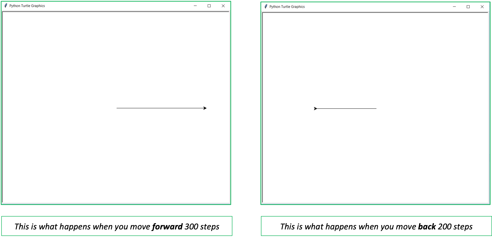
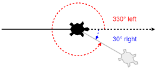
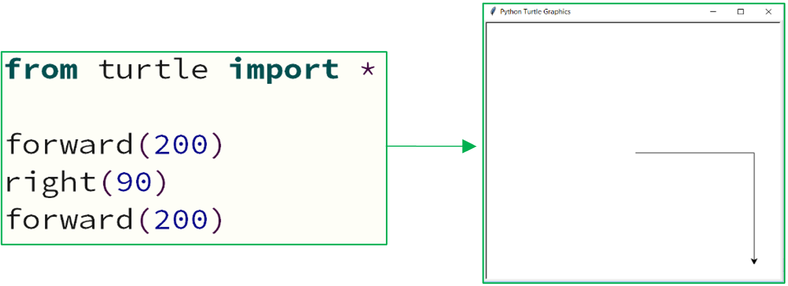
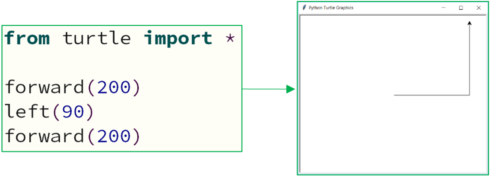
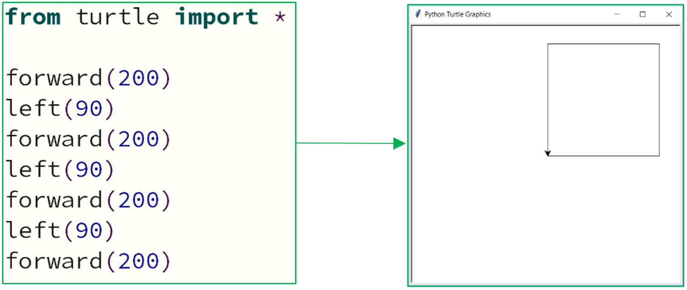
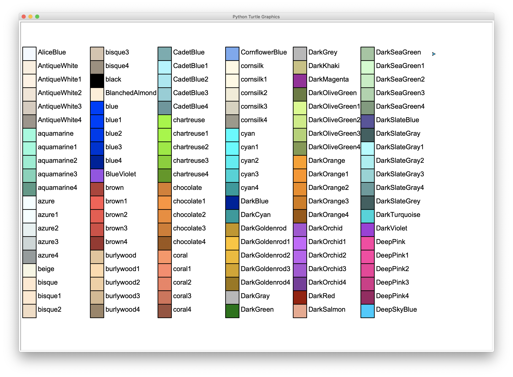

# Movement and Colour

## Moving the Turtle

You need to think of the Turtle as a pen – as it moves across your screen (which is your canvas), it will draw a line. We can move the Turtle forward and back. 

The bigger the number, the further your turtle will go. Obviously, the smaller the number, the smaller the line that the Turtle will draw. **Try it out!**

<figure markdown="span">
  { width="800" }
</figure>

## Changing Direction

By default, your Turtle will always start facing to the right. 

It is, however, easy to change the direction in which the Turtle will draw a line. 

To do this, you will need to tell the Turtle which direction to turn (left or right) and at how many degrees. 

Below is an example of how many degrees you would need to turn the Turtle to head off towards the bottom right of the page. 

You could either turn left or right – it’s just the number of degrees that you turn that will change.

<figure markdown="span">
  { width="400" }
</figure>

## Examples

Let’s move your Turtle to create a right angle (90-degrees):

<figure markdown="span">
  { width="600" }
</figure>

If we were to run the same code, but turn to the left, it would look like this:

<figure markdown="span">
  { width="600" }
</figure>

By continuing to turn at 90-degrees, you are able to make your first shape:

<figure markdown="span">
  { width="600" }
</figure>

## Changing Colour & Size

You are able to add a splash of colour to your lines by using the color function. 

A list of all the different colours you can use can be seen below:

<figure markdown="span">
  { width="900" }
</figure>

## Changing the Colour of the Pen

You can change the color of your pen by using the `color` function. 

<figure markdown="span">
  { width="300" }
</figure>

## Changing the Line Thickness

You can change the thickness of your line by using the `pensize` function. 

The higher the number, the thicker the line becomes:

<figure markdown="span">
  { width="300" }
</figure>

!!! question "Tasks"

    1. **Write a program that will draw an equilateral triangle. Each side needs to be 100 steps in length. The angle at which you need to turn is 120-degrees.**

    <figure markdown="span">
    { width="100" }
    </figure>

