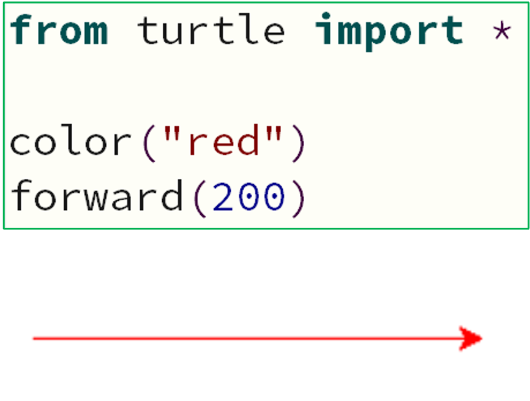
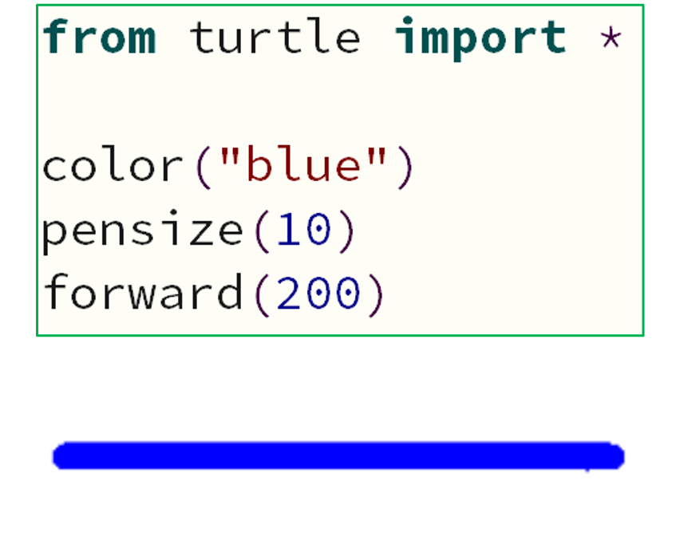
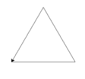
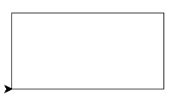
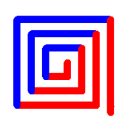

---
hide:
  - toc
---

# Movement and Colour

## Moving the Turtle

You need to think of the Turtle as a pen – as it moves across your screen (which is your canvas), it will draw a line. We can move the Turtle forward and back. 

The bigger the number, the further your turtle will go. Obviously, the smaller the number, the smaller the line that the Turtle will draw. **Try it out!**

<figure markdown="span">
  { width="800" }
</figure>

## Changing Direction

By default, your Turtle will always start facing to the right. 

It is, however, easy to change the direction in which the Turtle will draw a line. 

To do this, you will need to tell the Turtle which direction to turn (left or right) and at how many degrees. 

Below is an example of how many degrees you would need to turn the Turtle to head off towards the bottom right of the page. 

You could either turn left or right – it’s just the number of degrees that you turn that will change.

<figure markdown="span">
  { width="400" }
</figure>

## Examples

Let’s move your Turtle to create a right angle (90-degrees):

<figure markdown="span">
  { width="600" }
</figure>

If we were to run the same code, but turn to the left, it would look like this:

<figure markdown="span">
  { width="600" }
</figure>

By continuing to turn at 90-degrees, you are able to make your first shape:

<figure markdown="span">
  { width="600" }
</figure>

## Changing Colour & Size

You are able to add a splash of colour to your lines by using the color function. 

A list of all the different colours you can use can be seen below:

<figure markdown="span">
  { width="900" }
</figure>

## Changing the Colour of the Pen

You can change the color of your pen by using the `color` function. 

<figure markdown="span">
  { width="300" }
</figure>

## Changing the Line Thickness

You can change the thickness of your line by using the `pensize` function. 

The higher the number, the thicker the line becomes:

<figure markdown="span">
  { width="300" }
</figure>

!!! question "Tasks"

    ## Turing and Hopper

    ### 1 - Triangle

    **Write a program that will draw an equilateral triangle. Each side needs to be 100 steps in length. The angle at which you need to turn is 120-degrees.**

    <figure markdown="span">
    { width="150" }
    </figure>

    ??? info "🆘 Help!"

        [:fontawesome-brands-square-youtube: Code a Triangle Tutorial](https://youtu.be/T8BL-MHMZkc?si=g9l-IypKdliFY38i)
    
    ### 2 - Rectangle
    
    **Write a program that will draw a rectangle. The longer sides should be 200 steps in size. The shorter sides need to be 100 steps.**

    <figure markdown="span">
    { width="150" }
    </figure>

    ??? info "🆘 Help!"

        [:fontawesome-brands-square-youtube: Code a Square Tutorial](https://youtu.be/yhhsJgXyok8?si=I82dJrWYe_H-yIRy)

    ## Hopper

    ### 3 - House
    
    **Write a program that will draw a simple house. All sides of the house and roof need to be 100 steps long. When drawing the house, try and do it so that the house is drawn with one single line – meaning, you should not draw over any existing lines.**

    <figure markdown="span">
    { width="150" }
    </figure>

!!! warning "Extra Credit Tasks"

    ### 1 - Heartbeat
    
    **Create a red heartbeat pattern that you would see on a heartbeat monitor.**
    
    **It will have 3 pulses that:**

      * **Moves 20 steps forward before the start of the pulse;**
      * **Turns 80° left to draw the start of the pulse;**
      * **Moves 20 steps up to draw the start of the pulse;**
      * **Turns 160° right at the top of the pulse;**
      * **Moves 40 steps to draw the main part of the pulse;**
      * **Turns 160° left at the bottom of the pulse;**
      * **Moves another 20 steps to draw the last part of the pulse;**
      * **Has a gap of 40 steps between each pulse**
    
    <figure markdown="span">
    { width="250" }
    </figure>

    ### 2 - Square Pattern
    
    **Write a program that will recreate the coloured pattern in the image on the right. You will need to use any 2 colours and a line thickness of 10.**
    
    **It might seem tricky, but once you work out the pattern, it is quite easy!**

    <figure markdown="span">
    { width="150" }
    </figure>

